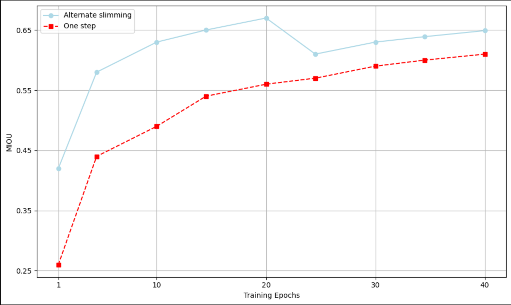

# HPML Project Spring 2024
Jay Roy (jgr7704)
Arjav Virani (av3451)

## Project Description 

The project's primary goal is to refine neural tissue segmentation by optimizing the Segment Anything Model (SAM) into Neuro-SAM and performing a comparative analysis of various image segmentation models on neuron histology datasets. It aims to merge high-performance computing (HPC)
advancements with precise neurological histology analysis through:
o Fine-Tuning Neuro-SAM: Leveraging high-performance computing techniques to fine-tune Meta’s
SAM for enhanced segmentation of axon and myelin in neural tissue images, focusing on increasing
segmentation accuracy while optimizing for computational efficiency.
o Comparative Analysis of Segmentation Models: Evaluating a range of image segmentation models,
including but not limited to Neuro-SAM, Med-SAM, and U-Net, on their ability to accurately and efficiently process neuron histology images. This involves assessing each model’s performance before and after the application of various optimization techniques such as mixed-precision training, distributed training, and model pruning.
o Optimization Benchmarking: Identifying and implementing the most effective HPC and machine learning optimization techniques for each model, with the goal of reducing inference times, enhancing model scalability, and maintaining or improving segmentation accuracy.
o Practical Application and Scalability: Demonstrating the practical applicability of optimized models in real-world neurological research settings, including the potential for real-time analysis and scalability to large datasets commonly found in neuron histology studies.

## Commands to execute the code        
run below script HPC


```
#!/bin/bash

#SBATCH --cpus-per-task=8
#SBATCH --time=20:00:00
#SBATCH --mem=64GB
#SBATCH --gres=gpu:4
#SBATCH --job-name=torch
#SBATCH --output="%x.txt"
#SBATCH --partition=n1c24m128-v100-4

echo "GPU: $(nvidia-smi -q | grep 'Product Name')"

module load intel/19.1.2
module load anaconda3/2020.07
module load python/intel/3.8.6
module load cuda/11.6.2

# Run your Python script
python neurosam.py
```

## Results
### base model


### Optimization




Using DistributedDataParallel (DDP) for training models on multiple GPUs can significantly decrease training time for all three models. DDP allows for efficient parallelization of model training across GPUs, enabling simultaneous processing of batches on different devices.

When using 0 workers in the DataLoader, training time is halved when using 2 GPUs due to the efficient utilization of GPU resources. However, as the number of GPUs increases from 2 to 4, training time increases considerably. This is likely due to increased communication overhead and synchronization between GPUs, which can offset the benefits of parallelization.

On the other hand, when the number of workers in the DataLoader is not 0, training time for all three models decreases as the number of GPUs increases. This is because the data loading process becomes more efficient with multiple workers, allowing the GPUs to stay fully utilized without waiting for data.

However, it's essential to note that increasing the number of workers in the DataLoader can also increase training time for all three models. This is because each worker process consumes CPU memory and incurs overhead in data loading coordination, which can lead to diminishing returns or even slower training if the number of workers is set too high. Therefore, finding the optimal balance between the number of workers and GPUs is crucial for maximizing training efficiency.
